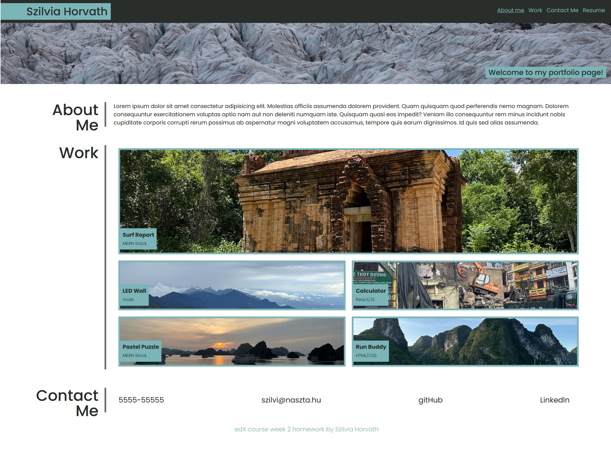

# portfolio-hsz

# Table of content

[Overview](#Overview)
[Screenshots](#Screenshots)
[Links](#Links)
[My_process](#My_process)
[Built_with](#Built_with)
[What_I_learned](#What_I_learned)
[Continued_developement](#Continued_developement)
[Author](#Author)

# Overview
This is the solution of the 2nd week challange. In this challange I had to make at least 10 commits to github, recreate the portfolio website from scratch. 

## Screenshots
wireframe [wireframe](./assets/images/portfolio-edx-wireframe.png)
portfolio-hsz screen shot 
[screen shots desktopview](./assets/images/screenshot-full-hover-on-work-pics.jpg)
[screen shots mobileview](./assets/images/screenshot-mobile-view.jpg)

### Links
portfolio-hsz on github[https://github.com/hszilvi/portfolio-hsz]
live link[https://hszilvi.github.io/portfolio-hsz/]

## My_process
I recreated the layout was given, added responsivity. Started mobile view first. 
I used HTML, CSS to make the website work and meet all the layout criterias. And learned how to apply flexbox and grid and how to use media queries.
I used gitBash to commit all the changes I made on the project using git add . / git commit -m '' / and git push commands. 
I wrote the readme.md with the relative path to screen shot and links and other expected contents. 

### Built_with
HTML, CSS, VS code
For checking my code I used HTML validator (W3School) and my browser extension for accessability evaluation. 

## What_I_learned
After this practise I became confident in using git Bash and better understand HTML tags and CSS. I understood how flexbox and grids work.

### Continued_developement
- I still need to learn more about SEO aspects,
- need to start using git branches to improve my github knowledge, 
- need to practise more CSS,
- use media queries.

## Author
Szilvia Horvath
GitHub[https://github.com/hszilvi]
LinkedIn[https://www.linkedin.com/in/horvathszilvi/]

sources:
https://validator.w3.org/nu/
https://css-tricks.com/snippets/css/a-guide-to-flexbox/
https://css-tricks.com/snippets/css/complete-guide-grid/goo
https://favicon.io/favicon-generator/
https://fonts.google.com/

